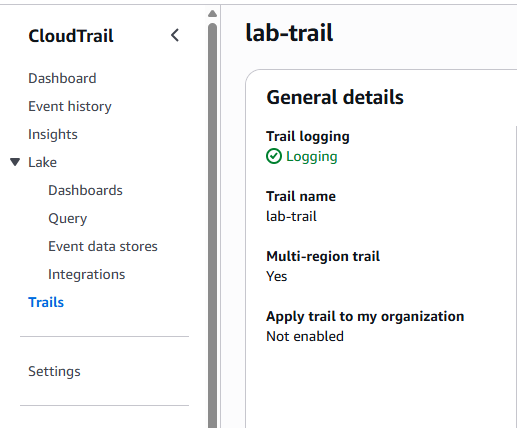
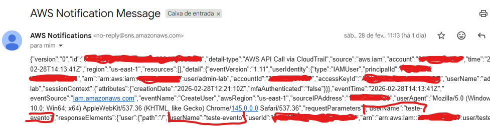
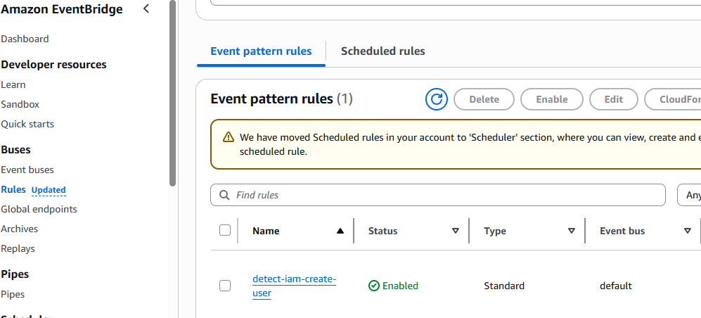
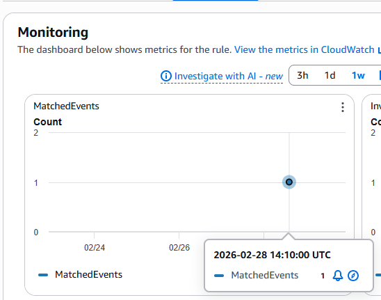
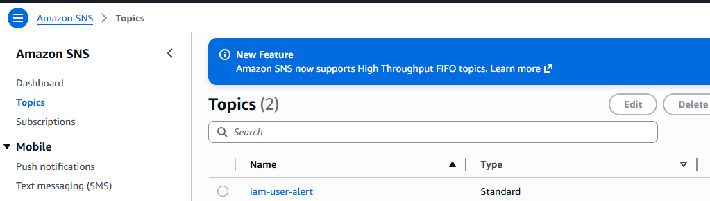
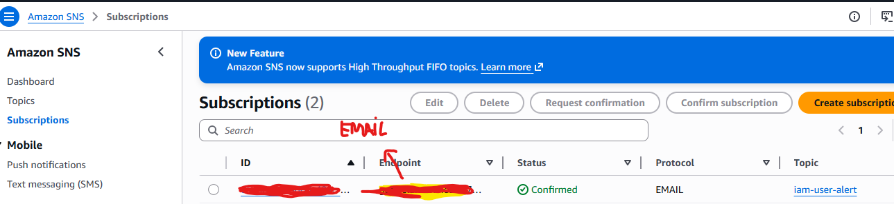

--Objective--

Detect IAM user creation events and trigger real-time email alerts using AWS native services.

--Services Used--

AWS IAM
AWS CloudTrail
AWS EventBridge
AWS SNS

--Architecture Flow--

IAM → CloudTrail → EventBridge → SNS → Email Alert

--Event Pattern Used--
{
  "source": ["aws.iam"],
  "detail-type": ["AWS API Call via CloudTrail"],
  "detail": {
    "eventSource": ["iam.amazonaws.com"],
    "eventName": ["CreateUser"]
  }
}

--Proof of Execution--
## 📸 CloudTrail Enabled

## 📸 Email

## 📸 EventBridge

## 📸 Monitoring event

## 📸 SNS

## 📸 Subscription

--Security Concept Demonstrated--

Real-time IAM monitoring
Event-driven architecture
Cloud-native detection engineering
Basic SOC alert simulation
